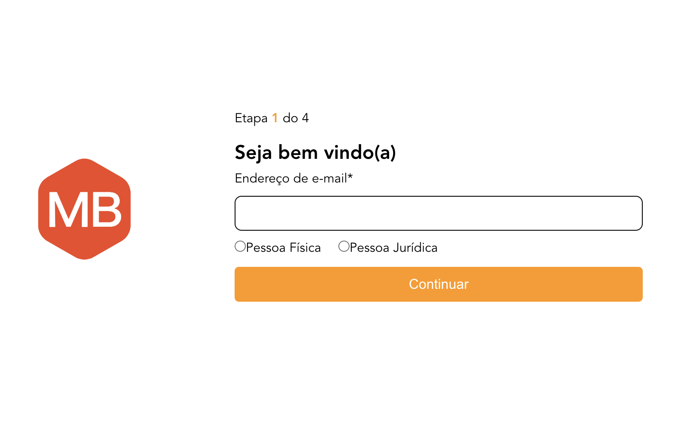
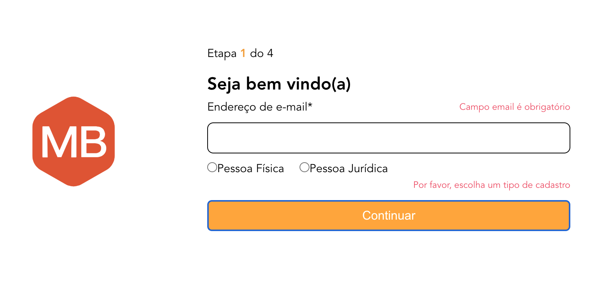
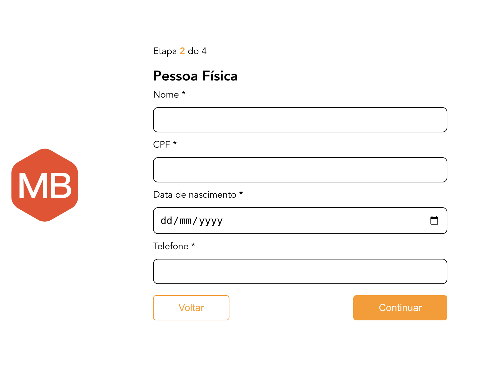
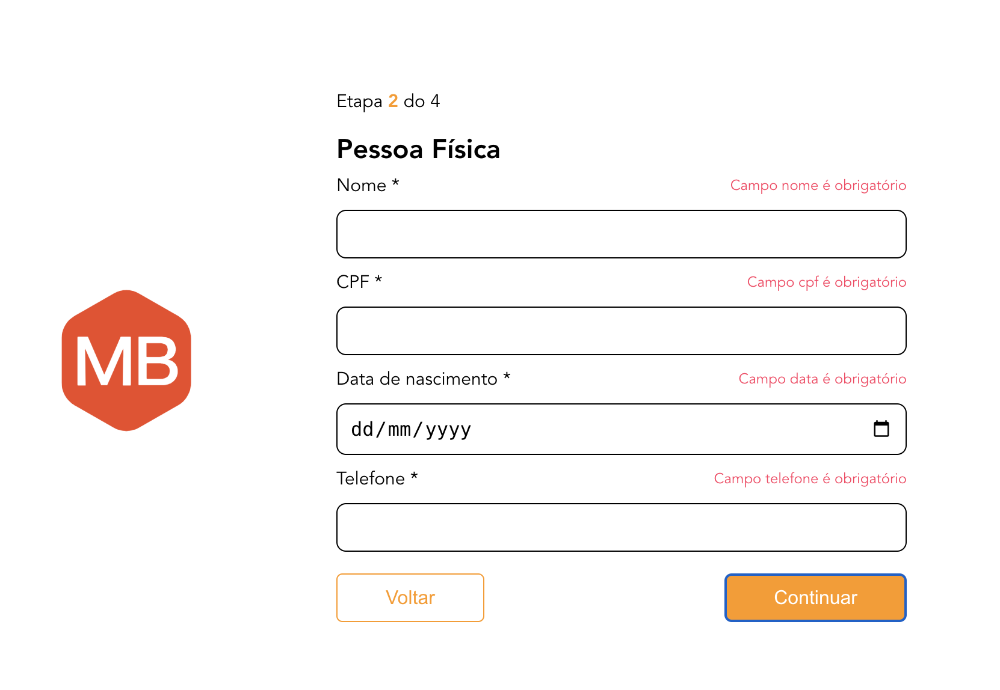
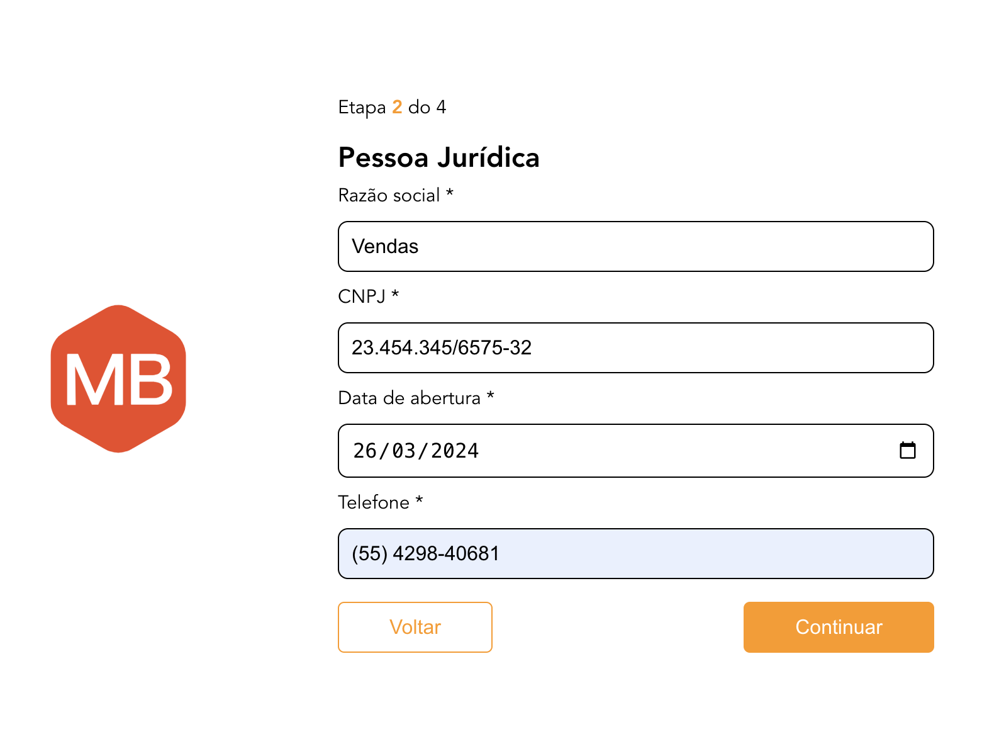
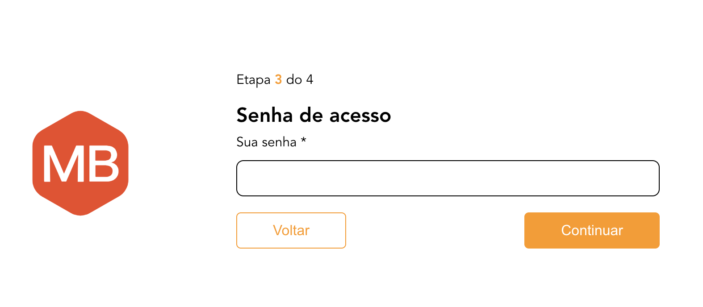
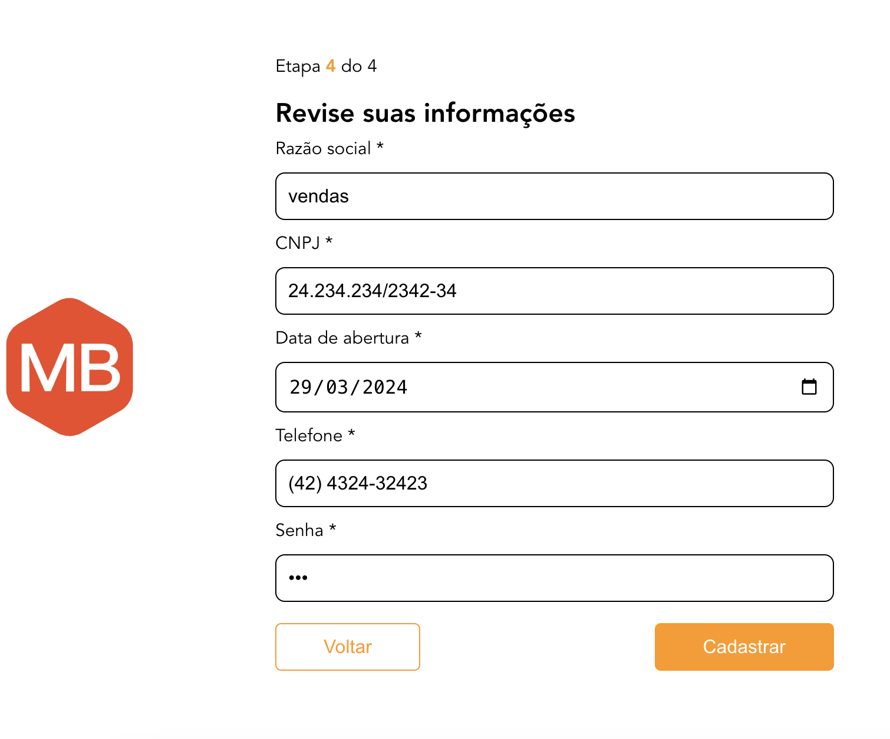
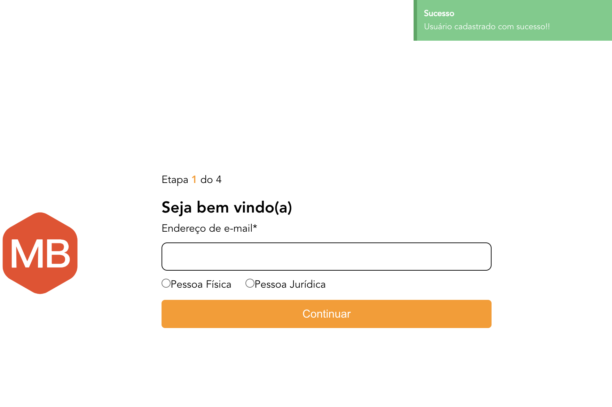

## Test MB Web - Registration users

## About Project:
This project is a front-end application that offers user registration functionalities. The form is divided into steps and each step contains validations. There are two types of users: **individual** or **legal entity**.

### Technologies
#### Client:

- [Vue.js](https://vuejs.org/)
- [@kyvg/vue3-notification](https://github.com/kyvg/vue3-notification)
- [v-mask](https://github.com/probil/v-mask)

## Development Tools

- [Vite](https://vitejs.dev/)
- [Prettier](https://prettier.io/)
- [ESLint](https://eslint.org/)


## 🚀 Getting Started

### Prerequisites
- Node 16
- Git 2

### Install project

```bash
git git@github.com:amand4/desafio-mb-web.git
cd desafio-mb-web
cd frontend
npm install
```

### Start project
To start the project, run the following command:

```bash
npm run dev
```
Open `http://localhost:5173` to view it in the browser.

### Compile and Minify for Production

```sh
npm run build
```
- To test the complete flow you can run the server and access. Follow the server installation steps, run and access  **http://localhost:3000/registration**

### Feature: Registration user:

1. **Step 1:**

   - Fill in all fields.
   - Click the "Continuar" button.
   - If ok, go to the next step.

   

   - If you do not fill in all the information. The fields that contain an error will be displayed.

   
     
---

2. **Step 2:**

   - Fill in all fields.
   - Click the "Continuar" button.
   - If ok, go to the next step.
   - Click the "Voltar" button - to return to the previous step

   ### Entity Individual

   

   - If you do not fill in all the information. The fields that contain an error will be displayed.

   

   ### Entity Legal

   
     
---

3. **Step 3:**

   - Fill in all fields.
   - Click the "Continuar" button.
   - If ok, go to the next step.
   - Click the "Voltar" button - to return to the previous step

   

   - If you do not fill in all the information. The fields that contain an error will be displayed.

---

4. **Step 4:**

   - Fill in all fields.
   - Click the "Voltar" button - to return to the previous step
   - Click the "Cadastrar" button.

   

   - Will register the user if all information is correct.
   - and returns the user to the initial step

    


